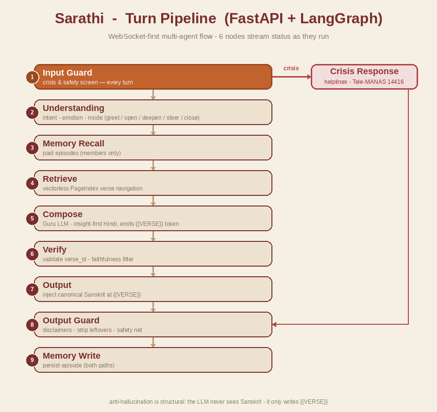

<h1 align="center">🪈 Sarathi — Backend</h1>

<p align="center">
  <b>A Bhagavad-Gītā "wise guru" AI assistant.</b><br/>
  Lead with the human problem · answer in plain शुद्ध हिंदी · reveal the verse as proof.
</p>

<p align="center">
  
  
  
  
  
</p>

> **Sarathi** (*सारथि* — "charioteer", as Krishna guided Arjuna) is a sacred-texts assistant. v1 covers
> the **Bhagavad Gītā**. It is built to reach **everyone** — the devout and the skeptic — by leading
> with the person's real struggle and offering scripture as timeless human wisdom, never as a sermon.

---

## 📑 Table of contents

- [Architecture](#-architecture) · [Safe by design](#-safe-by-design) · [Tech stack](#-tech-stack)
- [Project structure](#-project-structure) · [Quick start](#-quick-start) · [Configuration](#%EF%B8%8F-configuration)
- [API reference](#-api-reference) · [Conversation dynamics](#-conversation-dynamics) · [Testing](#-testing) · [Future scope](#-future-scope)

---

## 🏛 Architecture

A single user turn flows through a **LangGraph multi-agent pipeline**. Each node streams its status
live over the WebSocket as it runs; a crisis signal can short-circuit the whole flow at the first gate.

<p align="center">
  
</p>

```
START ─▶ input_guard ──crisis?──▶ crisis_response ─┐
             │ continue                            ├─▶ output_guard ─▶ memory_write ─▶ END
             ▼                                      │
   understanding ─▶ memory_recall ─▶ retrieve ─▶ compose ─▶ verify ─▶ output ─┘
```

| # | Node | Responsibility |
|:-:|------|----------------|
| 1 | **input_guard** | Crisis / self-harm detection on **every** turn (tuned to over-trigger); jailbreak & harm flags |
| 2 | **understanding** | Language · intent · emotion · core concern → sets the authoritative `response_mode` |
| 3 | **memory_recall** | Recall past episodes (logged-in members only) |
| 4 | **retrieve** | Vectorless **PageIndex** tree-navigation over the Gītā to pick candidate verses |
| 5 | **compose** | Guru LLM writes insight-first Hindi and emits a `{{VERSE}}` token (never Sanskrit) |
| 6 | **verify** | Validate `verse_id` against the corpus + optional faithfulness filter |
| 7 | **output** | Inject **canonical Sanskrit** from `verses.json` where `{{VERSE}}` appears |
| 8 | **output_guard** | Disclaimers on sensitive emotion, strip leftovers, harm-to-others refusal |
| 9 | **memory_write** | Persist the episode (both paths; guests write nothing) |

---

## 🔒 Safe by design

- **Fabrication is structurally impossible.** The LLM is *never* shown Sanskrit — it receives only a
  verse `id` + plain-Hindi meaning and writes the literal token `{{VERSE}}`. The backend injects the
  canonical scripture from `verses.json`. The model **cannot** invent a verse.
- **Crisis-first.** A self-harm signal short-circuits to a compassionate Hindi response with verified
  helplines (**Tele-MANAS 14416** + AASRA + 112) before anything else runs.
- **Honest degradation.** If the primary model is down, the router falls back and flags
  `degraded: true` rather than pretending.
- **Graceful provider ladder** with a per-provider circuit breaker: `OpenRouter → Ollama → Stub`.

---

## 🧰 Tech stack

| Layer | Choice |
|-------|--------|
| Language / runtime | Python **3.10–3.12** |
| Web / transport | **FastAPI**, WebSocket-first (`uvicorn[standard]`) |
| Orchestration | **LangGraph** multi-agent `StateGraph` |
| Retrieval | Vectorless **PageIndex** (LLM tree-navigation) + deterministic theme-map fallback |
| LLM providers | **OpenRouter** (Hindi-strong) → **Ollama** (Qwen2.5) → deterministic **Stub** |
| Storage | **MongoDB** (`motor`, optional) or in-memory store |
| Observability | `structlog` + in-process metrics (`/metrics`) |
| Packaging | **Poetry** (`package-mode = false`) |

---

## 📂 Project structure

```text
backend/
├── asgi.py                  # entrypoint — exposes `application`, runs uvicorn
├── pyproject.toml           # Poetry deps + pytest config
├── app/
│   ├── main.py              # FastAPI app + lifespan
│   ├── api/                 # routes.py (REST) · ws.py (WebSocket /ws/chat)
│   ├── core/                # config · logging · budget · metrics
│   ├── graph/               # build.py + nodes/ (the pipeline above)
│   ├── llm/                 # router · providers (openrouter/ollama) · prompts · stub
│   ├── retrieval/           # corpus loader · pageindex navigation
│   ├── guardrails/          # crisis.py · safety.py
│   ├── memory/ + db/        # episodic memory + store (mongo / in-memory)
│   └── eval/                # golden set + scoring harness
├── data/corpus/bhagavad_gita/   # verses.json · tree_index.json · theme_map.json
├── scripts/                 # ingest_gita.py · build_tree_index.py · run_eval.py
└── tests/                   # 38 pytest cases
```

---

## 🚀 Quick start

> **Prerequisites:** [Poetry](https://python-poetry.org/) and Python 3.10–3.12. Run all commands from `backend/` so `.env` loads.

```bash
# 1) install dependencies into a dedicated Poetry virtualenv
poetry env use python3.12
poetry install

# 2) configure (see below); at minimum an OpenRouter key for good Hindi
cp .env.example .env        # then edit

# 3) run the server (debug + auto-reload)
poetry run python asgi.py
#    └─ or:  poetry run uvicorn app.main:app --port 8088 --reload --log-level debug
```

API → **http://127.0.0.1:8088** · WebSocket → **ws://127.0.0.1:8088/ws/chat**

> Runs **fully keyless** out of the box (stub / in-memory / degraded). Add an OpenRouter key for real guru-quality Hindi.

---

## ⚙️ Configuration

All settings use the `SARATHI_` env prefix (loaded from `backend/.env`). Most-used:

| Variable | Default | Purpose |
|----------|---------|---------|
| `SARATHI_OPENROUTER_API_KEY` | — | Primary, Hindi-strong model. **Unset → degraded.** |
| `SARATHI_LLM_PROVIDER` | `router` | `router` (failover) or `stub` |
| `SARATHI_OLLAMA_ENABLED` | `false` | Enable the local Ollama fallback |
| `SARATHI_OLLAMA_HOST` · `SARATHI_OLLAMA_MODEL` | `localhost:11434` · `qwen2.5:7b` | Ollama config |
| `SARATHI_ALLOW_STUB_FALLBACK` | `true` | Allow the deterministic stub as last resort |
| `SARATHI_MONGO_ENABLED` · `SARATHI_MONGO_URI` | `false` · `localhost:27017` | Persistent episodic memory |
| `SARATHI_HOST` · `SARATHI_PORT` · `SARATHI_RELOAD` | `127.0.0.1` · `8088` · `true` | Used by `asgi.py` |

> 💡 `degraded: true` means the primary model was unavailable and a fallback answered — an honesty signal, not an error.

---

## 🔌 API reference

| Method | Path | Description |
|:------:|------|-------------|
| `WS` | `/ws/chat` | Main chat. Emits typed events: `meta · status · token · verse_card · safety · done · error`. Send `{type:"auth", email}` to upgrade to the member tier. |
| `GET` | `/health` | Liveness + provider / circuit / cache state |
| `GET` | `/metrics` | Turn counters, mode mix, grounded / degraded / crisis rates, latency p50/p95 |
| `POST` | `/session` | New guest session |
| `POST` | `/auth` | Email login → member tier (persistent memory) |

---

## 🗣 Conversation dynamics

The **understanding** node owns `response_mode` (the composer obeys — it does not self-classify).
Retrieval is skipped for no-verse modes, so **a greeting never triggers scripture**.

| Mode | When | Behaviour |
|------|------|-----------|
| `greet` | user only said hello | warm greeting + invite to share — **no verse, no diagnosis** |
| `open` | a fresh problem / question | full arc: acknowledge → insight → `{{VERSE}}` → one small step |
| `continue` | follow-up on the same thread | short, on-thread, usually no new verse |
| `deepen` | "how / why / tell me more" | one layer deeper; a verse if it adds something |
| `steer` | circling the same pain | gently redirect with one caring question |
| `close` | thankful / settled | a short, warm, blessing-like closing |

---

## 🧪 Testing

```bash
poetry run pytest -q                      # 38 tests
poetry run python scripts/run_eval.py     # golden-set eval (retrieval / safety / structure)
```

Covered: the structural anti-hallucination guarantee, provider failover + circuit breaker, crisis
short-circuit + helplines, greeting routing, episodic memory across connections, and the full
multi-agent turn.

---

## 🔭 Future scope

**Content & correctness**
- [ ] Expand the seed corpus (8 verses) to the full **700** via `scripts/ingest_gita.py`.
- [ ] **Gita-literate human review** of `theme_map.json` + the golden set — the real defense against *misapplication* (a real verse offered as the wrong advice).
- [ ] Promote the faithfulness LLM-judge from opt-in filter to a reviewed, measured gate.

**Trust, safety & privacy**
- [ ] Real authentication (email **OTP**), **encryption-at-rest**, retention enforcement & explicit consent.
- [ ] Re-verify all crisis helpline numbers per region; add locale-aware routing.
- [ ] Rate limiting, jailbreak hardening, audit logging.

**Platform & scale**
- [ ] Export metrics to **Prometheus / OpenTelemetry**; dashboards + alerts on degraded / crisis rates.
- [ ] Multi-text support (other sacred texts) behind the same retrieval contract.
- [ ] Multilingual output (regional Indian languages) while keeping the source-injection guarantee.
- [ ] Tune p95 latency / token budget (5–6 LLM calls per turn) and add response caching by concern.

---

<p align="center"><sub>Built with reverence. Scripture is the engine, not the front door. 🙏</sub></p>
